# Amplifier Behavior Study  
**Device Physics, Feedback, and Resonance in Inverter-Based Amplifiers**

---

## Overview

This project investigates how device type, feedback, and reactive components influence amplifier behavior across DC, AC, and transient domains using LTspice simulations.

### Core Concepts Demonstrated
- MOSFET vs BJT device physics
- Small-signal vs large-signal behavior
- Gain–bandwidth tradeoffs
- Negative feedback effects
- Resonance and damping
- Differential pair current steering

---

## Table of Contents

- [1. Device Comparison: NMOS vs BJT](#1-device-comparison-nmos-vs-bjt)
- [2. Negative Feedback and Stability](#2-negative-feedback-and-stability)
- [3. Resonance and Damping Study](#3-resonance-and-damping-study)
- [4. Differential Pair Operation](#4-differential-pair-operation)
- [Key Design Insights](#key-design-insights)

---

## 1. Device Comparison: NMOS vs BJT

### DC Behavior

A DC sweep was performed from 0 V to 5 V to compare the switching behavior of an NMOS inverter and a BJT inverter configured with identical load resistors. The NMOS output transitions near its threshold voltage (~1.5 V), while the BJT switches near the silicon base-emitter junction voltage (~0.7 V).

The BJT exhibits a noticeably sharper transition region. This occurs because collector current increases exponentially with VBE, whereas MOSFET drain current increases approximately quadratically with VGS. As a result, small input changes near threshold produce a more abrupt output change in the BJT configuration.

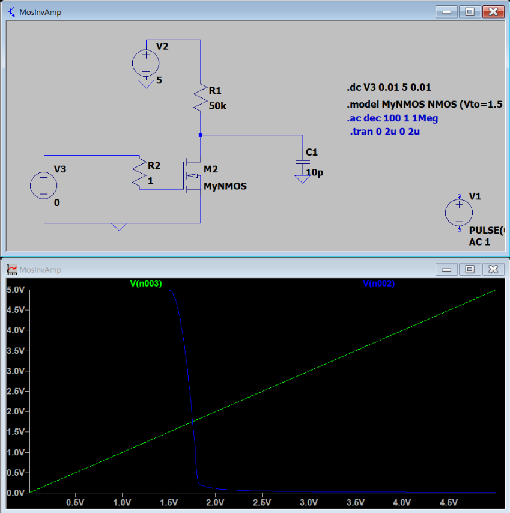

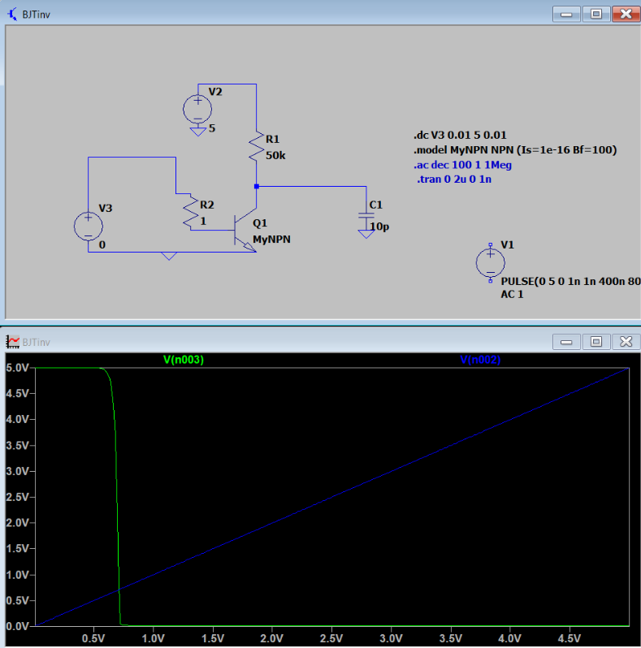

🔎 **Key Insight:**  
BJTs transition more sharply due to exponential conduction, while MOSFETs transition more gradually due to quadratic behavior.

---

### AC Response

An AC sweep from 1 Hz to 1 MHz was used to evaluate gain and phase behavior. Both inverters behave as inverting amplifiers at low frequency, showing ~180° phase shift. As frequency increases, capacitive loading introduces gain roll-off and phase shift reduction.

The BJT maintains its midband gain to a higher frequency than the NMOS configuration. This is primarily due to higher transconductance (gm) and lower output impedance, allowing it to drive the load more effectively before capacitive effects dominate.

**NMOS AC Sweep**

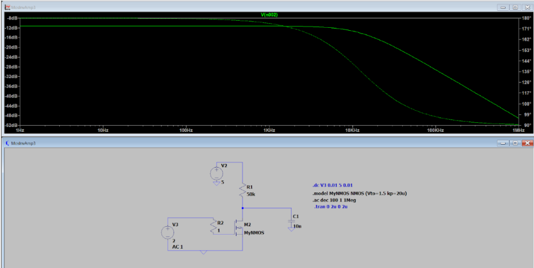

**BJT AC Sweep**

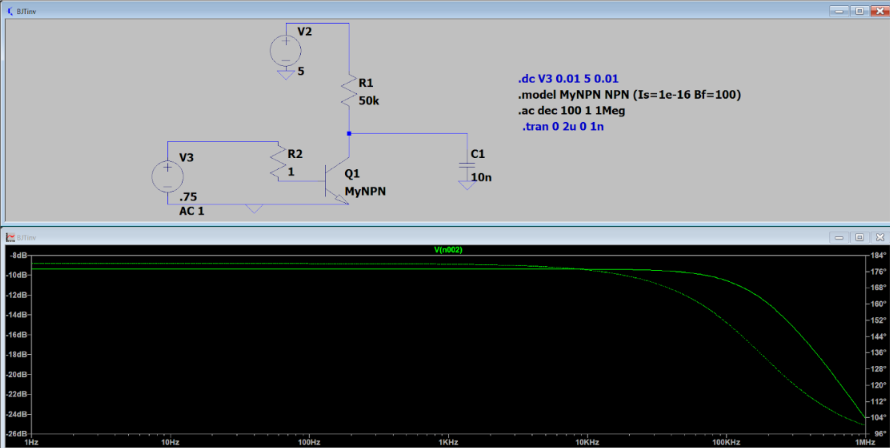

🔎 **Key Insight:**  
Higher transconductance in BJTs extends resistive behavior before capacitive rolloff.

---

### Transient Response

A pulse input (0 V–5 V) was applied to evaluate time-domain switching behavior. In both configurations, the output is pulled high when the device is off and pulled low when the device turns on, confirming expected inverter operation.

Despite differences in DC and AC behavior, both devices produce nearly identical transient waveforms under large input swings. This occurs because both operate as saturated switches in this regime. The rise time is governed by the RC time constant of the load network, while the fall time is faster due to the low on-resistance of the conducting device.

**NMOS Transient Response**

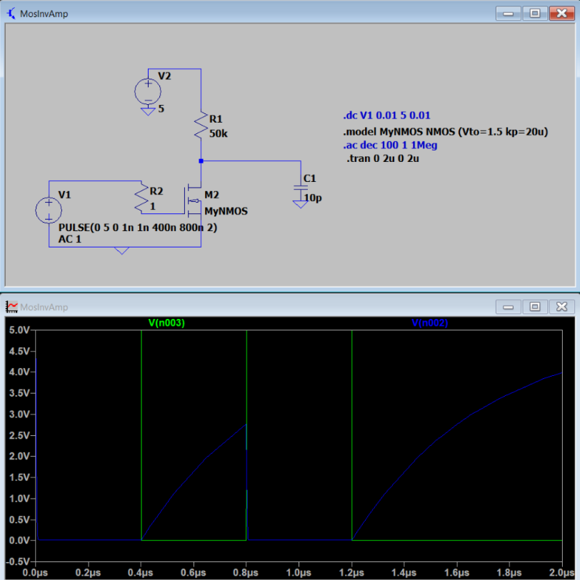

**BJT Transient Response**

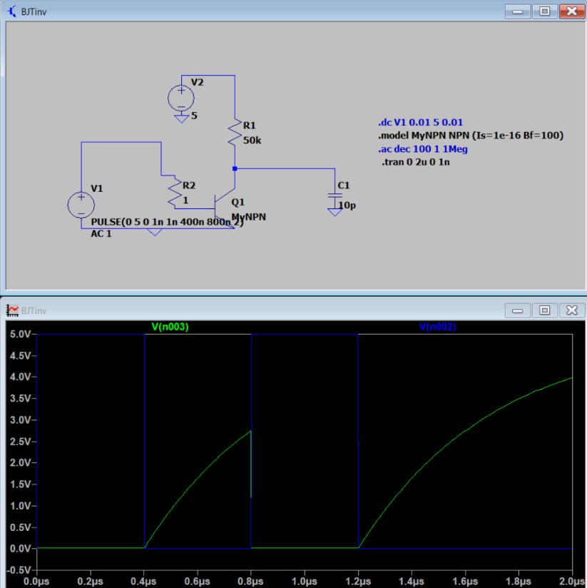

🔎 **Key Insight:**  
Under large-signal drive, both devices behave similarly as switches.

---

## 2. Negative Feedback and Stability

### Weak Feedback

With a 1 GΩ feedback resistor, minimal current is returned to the input node. As expected, the DC, AC, and transient behavior remain nearly identical to the open-loop case. The switching region remains sharp because the feedback is too weak to meaningfully influence the operating point.

### Strong Feedback

Reducing the feedback resistor to 5 kΩ significantly alters system behavior. In the DC sweep, the transition becomes more gradual as the output voltage feeds back into the input, partially counteracting changes in gate voltage.

In the frequency domain, gain begins rolling off at a lower frequency, illustrating the gain–bandwidth tradeoff introduced by negative feedback. In the transient response, output amplitude is reduced and rise time increases due to partial conduction during switching.

### Strong Feedback (5 kΩ)

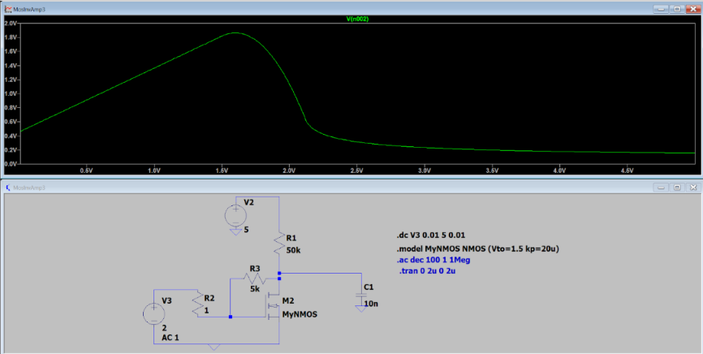

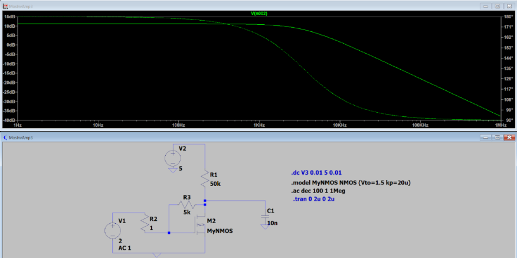

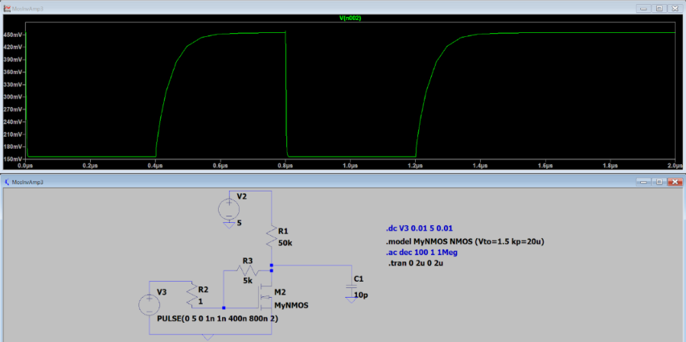

⚡ **Design Takeaway:**  
Strong negative feedback reduces gain but improves stability and smooths system response.

---

## 3. Resonance and Damping Study

### Light Damping (500kΩ)

Adding a 1 mH inductor in parallel with the load resistor introduces resonant behavior. With a 500 kΩ load, the circuit exhibits a sharp gain peak near resonance (~70 kHz) and a steep phase transition.

In the transient domain, oscillations gradually build as energy accumulates in the LC tank. Because the load resistance is large, damping is weak, allowing oscillation amplitude to grow before slowly decaying.

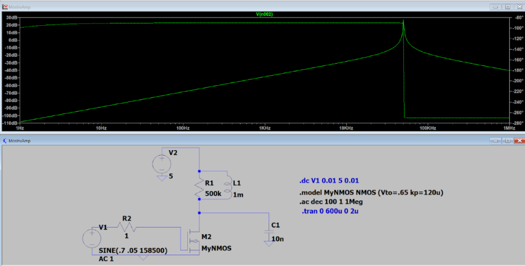

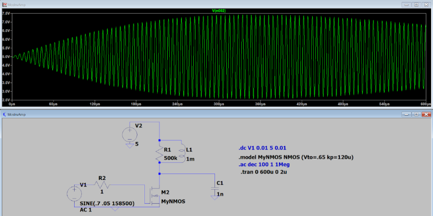

### Heavy Damping (5kΩ)

Reducing the load resistor to 5 kΩ introduces significant damping. The resonance peak becomes flattened, phase transition smooths, and oscillation amplitude is greatly reduced.

Energy stored in the inductor dissipates more quickly through the lower resistance, preventing sustained ringing and limiting peak amplitude.

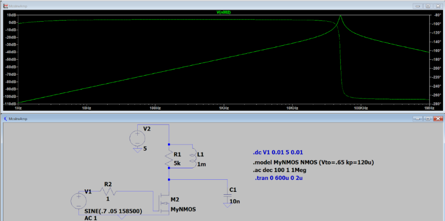

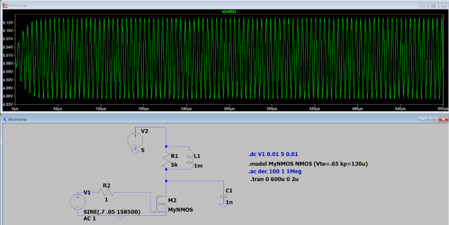

⚡ **Design Takeaway:**  
Load resistance directly controls damping strength and resonant amplitude.

---

## 4. Differential Pair Operation

A MOS differential pair was simulated with a DC sweep applied across the differential inputs. The resulting S-shaped transfer curve demonstrates current steering behavior.

At large negative differential voltages, nearly all tail current flows through one transistor, producing a flat output region. As the differential input approaches zero, current rapidly redistributes between the two devices, producing a steep transition region.

This narrow region around 0 V represents the high-sensitivity operating point of the differential pair, where small input changes produce large output variations.

⚡ **Design Takeaway:**  
Differential pairs amplify small input differences by redistributing bias current between matched devices.

---

## Key Design Insights

- Device physics directly influences switching sharpness and gain behavior.
- Negative feedback reshapes system stability and frequency response.
- Resonance strength is controlled by damping and reactive element size.
- Differential pairs operate through current steering near zero differential input.

---

## Appendix

Full simulation files and additional plots are included in the `/ltspice` and `/docs` folders.
